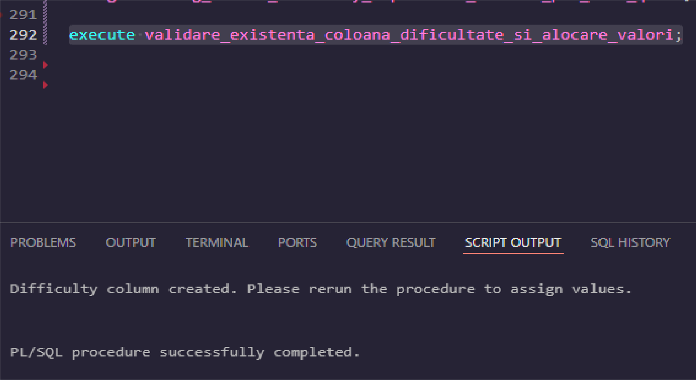
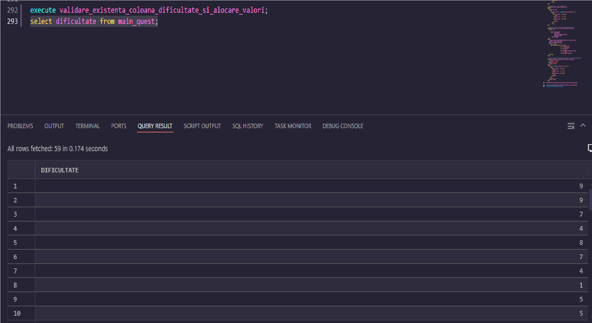
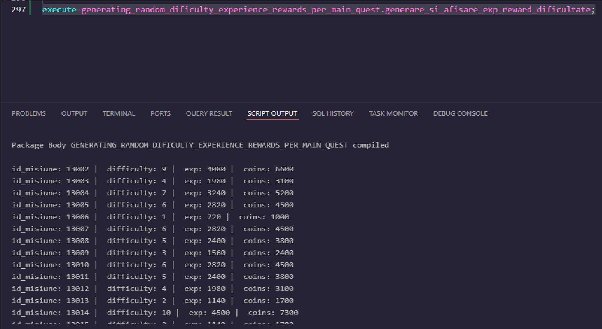
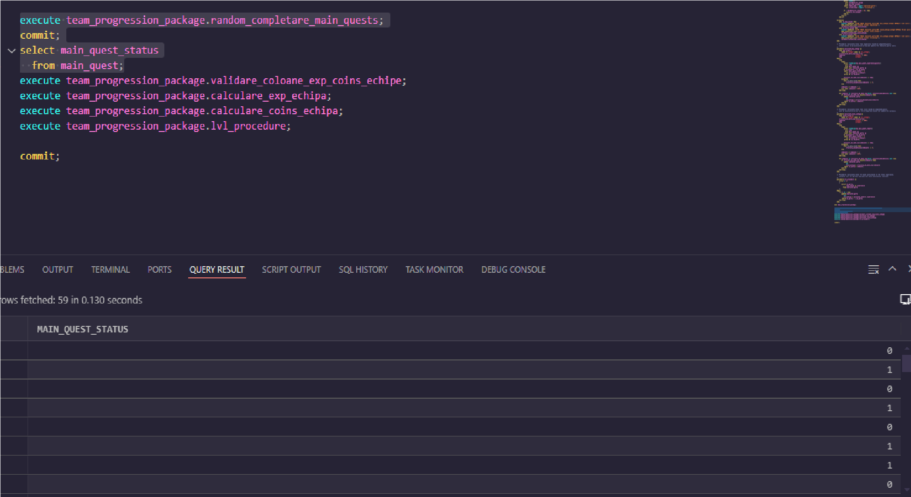

# Multi-Game_Management_System_Oracle_DB_Project

## **Project overview**

This project is a relational database designed to manage data for a game company with multiple games that share a similar structure. The database supports key game elements such as player accounts, guilds, main and side quests, an inventory/shop system and other addional elements, while allowing for future scalability and feature expansion.

## **Motivation behind this project idea:**

The main idea for this project was born out of a personal interest for creating a practical and cost-effective database solution tailored for small to medium-sized game studios. More precisely, these companies have in common the tendency to develop games, that share common structural features, such as player accounts, guilds system, maine & side quests, inventory systems, and many more.

By designing a reusable and adaptable relational database that addresses these shared needs, I aim to provide a foundation that can accelerate development and ensure consistent data management.

A key focus of this project is optimizing for performance and universal functionality, offering a solution that balances affordability and scalability. While vertical scaling has its limits, especially when it comes to increased data volume and processing demands, the proposed design can serve as a viable interim solution. For studios at an early or moderate scale, this approach might provide the flexibility to launch and iterate quickly, with the option to evolve infrastructure as requirements grow.

> **Notes**: This project is a continuous work in progress. I am actively working to improve its efficiency, scalability, and functionality. Accordingly, this repository serves as both a progress tracker and a documentation space, as I explore database design principles, query optimization techniques, and best practices in database administration and development.

## **Database Design Diagrams:**

First of all, let's checkout the database design diagrams.

- **dbdiagram** design pdf: `Database_Schemas\updated_schema_dbgrm.pdf`
- **Sql data modeler** design pdf: `Database_Schemas\updated_multigame_schema.pdf`

## **Technologies used:**

- Database Engine: **Oracle RDBMS**
- Tools:
  - **Code editors**: Oracle SQL Developer and Visual Studio Code (with the official extension from Oracle, called: Oracle SQL Developer Extension for VSC)
  - **Database Design**: Oracle SQL Data Modeler & dbdiagram.io

## **Prerequisites:**

- An Oracle server must be available, either installed locally or accessible remotely with proper configuration.
- SQL Developer or other Code Editors(ex: Visual Studio Code with the right extensions).
- A basic understanding of SQL querying and PL/SQL "scripting" might help you understand things faster, but it is not mandatory.

## **Steps for Creating Database Tables and Loading Mock Data:**

1. Run the SQL file `Scripts_for_creating_tables_+_mockdata\Create_empty_tables_vers2.1.sql` to create the database tables along with their interdependencies.

2. Run the SQL file `Scripts_for_creating_tables_+_mockdata\Create_empty_tables_vers2.1.sql` to populate the database with mock data using _INSERT_ statements. This dataset represents a single game that follows the proposed database structure.

3. After succesfully creating and loading the mock data from steps 1 and 2, down below will be detailed some functionalities that can be runned and used in order to enrich the database design and utility.

4. Feel free to send me recommandation of what kind of features you might wanna see in the future updates.

## **Functionalities:**

> **Note** the code for all functionalities can be found in the folder called: `PlSQL+SQL_micro-functionalities`, but I will list each functionalties relative path for easier identification.

### **Functionality #1: Add Difficulty Column and Assign Experience and Coin Rewards Based on Region and Difficulty for Each Main Quest**

> **Task description:**  
> The core concept involves building a package that encapsulates the following procedures and functions:
>
> - A procedure that creates a "difficulty" column for main quests (if not already present) and assigns random difficulty values.
> - A procedure that assigns experience points to the team based on a formula that factors in quest difficulty and region.
> - A procedure that assigns coin rewards to the team using a similar formula.
> - A procedure that calls the above three procedures and displays the results.
> - A function that calculates the value for experience/coins based on the difficulty and region formula from above.
> - After verifying functionality's procedures and function separately, I dropped and re-created them in a package for reuse and organization.
>   -!!! Important: first of all run at least once the first procedure before creating the package cause otherwise, it won't work

- Source code: [click here](PlSQL+SQL_micro-functionalities\Functionality_01_Difficulty_column_and_generating_random_exp_coins.sql)

- 

    
Expected Results:

     
    
    
    
  

### **Functionality #2: Setting completion status of main quest and calculates coin rewards,experience and level for each team**

> **Task description:**  
> Core concept: Building a package of procedures and functions that perform the following:
>
> - A procedure that updates the mission status column to mark quests as completed (1) or incomplete (0), randomly.
> - A procedure that verifies and creates (if necessary) three columns in the `character_party` table:
>   1. `exp_echipa` (team experience)
>   2. `coins_echipa` (team coins)
>   3. `lvl_echipa` (team level), which is calculated based on total experience.
> - A procedure that calculates experience per team, stores results in an indexed table, and updates the database accordingly.
> - A similar procedure that calculates and stores coin rewards per team.
> - A function that calculates the team level based on the total experience.
> - Finally, all logic is encapsulated into a package for reuse and modularity.
> - !! Important make sure you went at least once throguh the functionality 1 in order to be able to work with this one, just to be sure :)
> - VERY IMPORTANT FIRST OF ALL RUN THE FIRST 2 PROCEDURE INDEPENDENTLY TO GET THE COLUMNS AND THAT RANDOM VALUES, ONLY AFTER THAT DROP THE SPECIFIC PROCEDURES AND BUILD THE PACKAGE

- Source code: [click here](PlSQL+SQL_micro-functionalities\Functionality_02_Setting_completion_status_calculate_team_exp_coins_lvl.sql)

- 

    
Expected Results:

     
    
    
    
  

